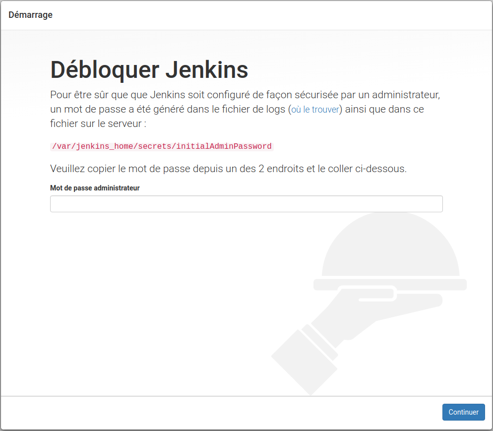

# Dev Factory

Mon but : une usine de dev à emporter pour la mêtre en place super rapidement chez mes clients qui n'en dispose pas.


## Stack

Cette usine de dev est composée classiquement de :
- Jenkins : Plateforme d'Intégration Continue (avec Blue Ocean parce que j'adore le mode déclaratif des pipelines)
- Sonar : Analyse de qualité de code
- MySQL : Base de données nécessaire à SanorQube


## Commande utiles

##### Démarrer toute la stack en tâche de fond :
```bash
$ docker-compose up -d
```

##### Arreter toute la stack :
```bash
$ docker-compose stop
```

##### Consulter les logs :
```bash
$ docker logs -f devfactory_jenkins
$ docker logs -f devfactory_sonarqube
$ docker logs -f devfactory_mysql
```
ou
```bash
$ docker-compose logs -f jenkins
$ docker-compose logs -f sonarqube
$ docker-compose logs -f mysql
```

## Jenkins
Docker : `jenkinsci/blueocean:1.3.5`

Au premier lancement, Jenkins affichera cette trace de log :
```bash
*************************************************************
*************************************************************
*************************************************************

Jenkins initial setup is required. An admin user has been created and a password generated.
Please use the following password to proceed to installation:

b0fec03846df487eb6b16ae778a459cb

This may also be found at: /var/jenkins_home/secrets/initialAdminPassword

*************************************************************
*************************************************************
*************************************************************
```

Il vous faut copier le mot de passe généré `b0fec03846df487eb6b16ae778a459cb` pour le coller dans l'[interface web Jenkins Blue Ocean](http://localhost:8000/blue) afin de le débloquer :



### Sonar
Docker : `sonarqube:6.7.1`


### MySQL
Docker : `mysql:8`
